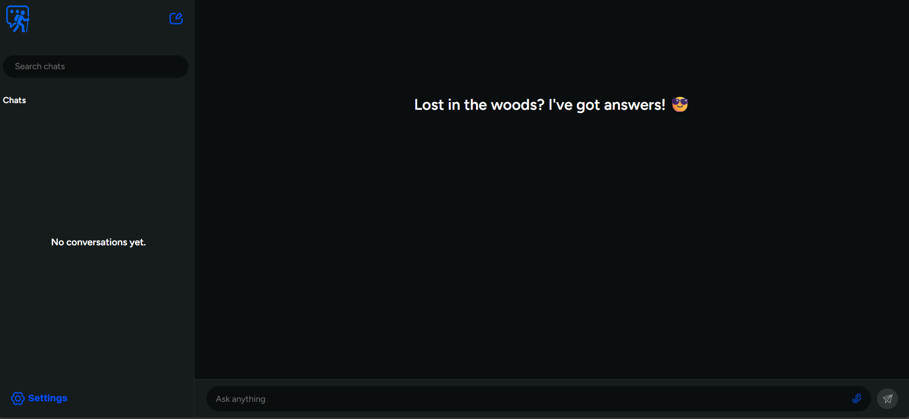

# 🤖 RAAB – AI Chatbot using MERN Stack, Socket.IO & Azure OpenAI

**RAAB (Responsive AI Assistant Bot)** is an intelligent hiking chatbot application built with the **MERN stack** (MongoDB, Express.js, React.js, Node.js), enhanced with **real-time messaging via Socket.IO**, and powered by the **OpenAI API through Azure**. RAAB delivers fast, natural conversations for use cases such as virtual assistance, customer support, and productivity tools.

---

## 🚀 Features

- 💬 **Real-time Chat with Socket.IO** – Fast and smooth message exchange between users and bot.
- 🧠 **AI-Powered Responses** – Integrates with Azure-hosted OpenAI models (e.g., GPT-4).
- 💾 **MongoDB Integration** – Persists chat messages for history and context.
- 🌐 **MERN Stack** – Full-stack JavaScript solution for scalability and performance.
- 🛡️ **Environment-Based Config** – Secure handling of API keys and deployment details.

---

## 🧱 Tech Stack

- **Frontend**: React.js  
- **Backend**: Node.js + Express.js  
- **Database**: MongoDB (via Mongoose)  
- **Real-Time**: Socket.IO  
- **AI Service**: Azure OpenAI (GPT-4 or GPT-3.5-turbo)  
- **Dev Tools**: dotenv, concurrently, CORS, Axios

---

## 📁 Project Structure

<pre> ``` 
  RAAB/ 
  ├── frontend/ 
  │ ├── public/ 
  │ └── src/ 
  │     ├── assets/ 
  │     ├── components/ 
  │     ├── css/ 
  │     ├── js/ 
  │     ├── App.jsx
  │     └── Main.jsx
  ├── backend/ 
  │ └── src/ 
  │     ├── config/ 
  │     ├── controllers/ 
  │     ├── models/ 
  │     ├── socket/ 
  │     ├── utils/ 
  │     ├── app.js
  │     ├── .env 
  │     └── server.js
  ├── .gitignore
  └── README.md
  ``` </pre>


---

## 🔧 Environment Variables

Create a `.env` file in the `backend/` directory with the following variables:

```env
PORT=3000
MONGO_URI=your_mongodb_connection_string
AZURE_OPENAI_KEY=your_azure_openai_api_key
AZURE_OPENAI_ENDPOINT=https://your-resource-name.openai.azure.com/
AZURE_DEPLOYMENT_NAME=your_deployment_name
```

## 🛠️ Installation & Running the App
**1. Clone the Repository**

```
git clone https://github.com/yourusername/raab-chatbot.git
cd raab-chatbot
```

**2. Install backend Dependencies**

```
cd backend
npm install
```

**3. Install frontend Dependencies**

```
cd ../frontend
npm install
```

**4. Run Both frontend and backend**

From the root directory:

```
npm run dev
```

Client: localhost:5173

Server + Socket.IO: localhost:3000

## ⚙️ How It Works
The user sends a message through the React frontend.

The message is transmitted to the backend in real-time using Socket.IO.

The backend sends the input to Azure OpenAI and receives a GPT-generated response.

The response is sent back to the frontend via Socket.IO and displayed.

All messages are optionally saved to MongoDB for history and retrieval.

## 🖼️ Screenshots
<p align="center">
  
</p>


## 📌 Future Enhancements
🛂 Add user authentication (e.g., JWT or OAuth)

💬 Support multiple conversation threads

🎙️ Integrate voice input/output (Web Speech API)

📈 Add admin analytics dashboard

☁️ Deploy on Azure Web Apps or Render


📄 License
This project is licensed under the MIT License.


📬 Contact
Bakwowi Junior
📧 Email: juniorbakwowi@gmail.com
🐙 GitHub: https://github.com/Bakwowi

